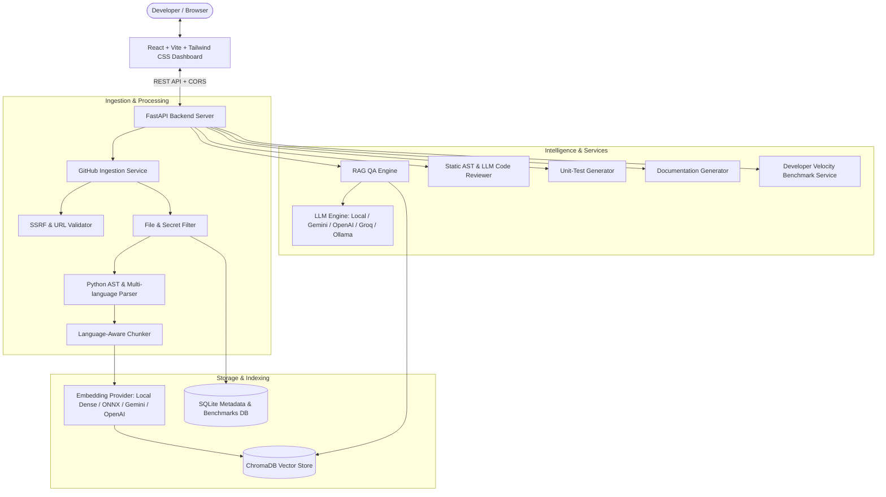

# CodeMind AI — AI-Powered Codebase Assistant Using RAG

**CodeMind AI** is a production-grade, portfolio-ready developer assistant that ingests public GitHub repositories, performs language-aware AST parsing and chunking, indexes source code into persistent ChromaDB vector collections, and provides grounded Retrieval-Augmented Generation (RAG) for codebase understanding, code search, automated security reviews, unit test generation, documentation generation, and developer velocity benchmarking.

---

## 1. Problem Statement & Objectives

Software engineers spend up to 60% of their time reading, navigating, and understanding unfamiliar codebases. Typical LLM chat interfaces suffer from hallucinations, fabricate non-existent APIs, lack cross-file context, or require pasting sensitive code into public web windows.

**CodeMind AI solves this by:**
1. Ingesting public GitHub repositories safely using verified REST APIs and streaming zipball archives.
2. Performing language-aware AST chunking that preserves class/function boundaries and exact line numbers.
3. Indexing code vectors into persistent ChromaDB collections isolated by repository.
4. Answering natural-language codebase questions grounded strictly in retrieved context.
5. Providing deterministic AST security analysis (detecting SQL injection, `eval()`, hardcoded secrets, unhandled exceptions) paired with AI code reviews.
6. Generating comprehensive unit tests (pytest for Python, Jest for JavaScript/TypeScript) and Markdown documentation.
7. Tracking empirical developer velocity benchmarks (comparing Manual vs AI-Assisted cycles).

---

## 2. System Architecture



### RAG Ingestion & Retrieval Workflow

1. **URL Validation & SSRF Guard**: The repository URL is checked against `https://github.com/{owner}/{repo}`. Loopback, private IP ranges (`10.0.0.0/8`, `192.168.0.0/16`, `127.0.0.1`), and cloud metadata endpoints (`169.254.169.254`) are strictly blocked.
2. **File Discovery & Filtering**: Source trees are traversed recursively. Binary files, compiled artifacts (`.pyc`, `.exe`, `.so`), vendor directories (`node_modules`, `.venv`, `.git`), and sensitive files (`.env`, `.pem`, `id_rsa`, `credentials.json`) are excluded.
3. **AST Parsing**: Python AST is parsed to extract classes, functions, async functions, parameters, docstrings, and cyclomatic complexity indicators. Generic regex parsers extract symbols for JS, TS, Java, and Go.
4. **Language-Aware Chunking**: Code is split along function/class boundaries where possible. Every chunk retains metadata: `file_path`, `start_line`, `end_line`, `symbol_name`, and `repository_id`.
5. **Persistent Vector Storage**: Chunks are embedded and stored in persistent ChromaDB collections with strict `repository_id` isolation to prevent cross-repository pollution.
6. **Context Grounding & Prompt Insulation**: User questions retrieve the top-K relevant chunks. Chunks are passed inside guarded context tags (`<UNTRUSTED_REPOSITORY_CONTEXT>`). The assistant answers only from verifiable evidence and cites file paths and line ranges.

---

## 3. Technology Stack

| Layer | Technologies |
|---|---|
| **Frontend** | React 18, Vite 5, Tailwind CSS, Lucide Icons, PrismJS |
| **Backend** | Python 3.11, FastAPI, Pydantic v2, Uvicorn, SQLAlchemy (Async), aiosqlite |
| **Vector DB & RAG** | ChromaDB (Persistent), Dense Vectorizer / ONNX MiniLM, Context-Grounded Prompting |
| **LLM Support** | Local Deterministic Synthesis (100% offline), Google Gemini, OpenAI, Groq, Ollama |
| **Code Analysis** | Python AST (`ast.NodeVisitor`), Multi-language Regex Heuristics, Ruff Linter |
| **Automated Testing** | Pytest, Pytest-Asyncio, HTTPX AsyncClient |

---

## 4. Project Folder Structure

```
AI-Based Codebase Analysis/
├── backend/
│   ├── app/
│   │   ├── api/              # FastAPI Routers (health, repos, chat, review, tests, docs, benchmarks)
│   │   ├── core/             # Configuration (pydantic-settings) & SSRF/Path security
│   │   ├── db/               # SQLAlchemy models & async SQLite session
│   │   ├── rag/              # Chunker, ChromaDB vectorstore, embeddings, LLM client, RAG engine
│   │   ├── repository/       # GitHub Ingestion, file filtering, AST parser
│   │   ├── schemas/          # Pydantic request & response models
│   │   ├── services/         # Code review, unit test gen, doc gen, velocity benchmarks
│   │   └── main.py           # FastAPI entrypoint, CORS, lifespan, SPA static mount
│   ├── tests/                # 20 Automated Unit & Integration tests
│   ├── .env.example          # Environment variable template
│   ├── requirements.txt      # Python dependencies
│   ├── ruff.toml             # Ruff linter configuration
│   └── pytest.ini            # Pytest configuration
├── frontend/
│   ├── src/
│   │   ├── components/       # Navbar, brand, system status, theme switcher
│   │   ├── pages/            # Dashboard, Overview, Chat, CodeExplorer, Review, TestGen, DocGen, Benchmarks, Settings
│   │   ├── services/         # Frontend API client
│   │   ├── App.jsx           # Main state coordinator & tab router
│   │   ├── index.css         # Tailwind & custom scrollbar styles
│   │   └── main.jsx          # React DOM entry
│   ├── package.json          # Frontend dependencies
│   ├── vite.config.js        # Vite config with backend API proxy
│   └── tailwind.config.js    # Tailwind styling config
├── docs/                     # Architecture and technical documentation
├── .gitignore                # Complete ignore rules for python, node, chroma, and sqlite
└── README.md                 # Complete project documentation
```

---

## 5. Prerequisites & Environment Setup (Windows PowerShell)

Ensure you have **Python 3.11+** and **Node.js 18+** installed.

### Step 1: Clone or Navigate to the Workspace
```powershell
cd "c:\Users\AJITHA\Documents\Projects\AI-Based Codebase Analysis"
```

### Step 2: Set Up Backend Virtual Environment
```powershell
# Create Python virtual environment
py -3.11 -m venv backend/.venv

# Activate virtual environment
.\backend\.venv\Scripts\Activate.ps1

# Install backend dependencies
pip install -r backend/requirements.txt
```

### Step 3: Configure Backend Environment
Create `backend/.env` from the provided template:
```powershell
Copy-Item backend/.env.example backend/.env
```

*Note: CodeMind AI includes a built-in Local Deterministic Engine and fast dense vectorizer. It is 100% operational out of the box without requiring external API keys. To connect cloud models, add your `GEMINI_API_KEY`, `OPENAI_API_KEY`, or `GROQ_API_KEY` into `backend/.env`.*

### Step 4: Set Up Frontend Dependencies
```powershell
cd frontend
npm install
npm run build
cd ..
```

---

## 6. Running the Application

### Option A: Combined Server (Recommended)
Because the built React frontend is mounted directly inside FastAPI, you can run the entire application using a single command:
```powershell
.\backend\.venv\Scripts\Activate.ps1
cd backend
python -m uvicorn app.main:app --host 127.0.0.1 --port 8000 --reload
```
Open your browser at: **[http://localhost:8000](http://localhost:8000)**

### Option B: Separate Frontend Development Server (with HMR)
In Terminal 1 (Backend):
```powershell
.\backend\.venv\Scripts\Activate.ps1
cd backend
python -m uvicorn app.main:app --host 127.0.0.1 --port 8000 --reload
```

In Terminal 2 (Frontend with Hot Module Replacement):
```powershell
cd frontend
npm run dev
```
Open your browser at: **[http://localhost:5173](http://localhost:5173)**

---

## 7. Interactive Features & Workflows

### A. Dashboard & Repository Ingestion
1. Paste any public GitHub URL (e.g. `https://github.com/pallets/flask` or `https://github.com/tiangolo/fastapi`).
2. Click **Analyze Repository**.
3. CodeMind AI streams the repository archive, filters out non-code assets and secrets, runs AST parsing, generates vector chunks, and indexes them into ChromaDB.
4. Already-scanned repositories (such as the included `pallets/flask` sample with 193 files and 2,340 chunks) can be opened immediately.

### B. Grounded AI Chat
- Ask natural-language codebase questions:
  - *"Explain the overall architecture of this repository."*
  - *"Where is user authentication implemented?"*
  - *"Which files handle database connections?"*
  - *"Explain how the login API works."*
- Every response includes collapsible **Retrieved Source Citations** showing exact file paths, line ranges (e.g. `src/auth.py (lines 14-45)`), relevance percentages, and syntax-highlighted code snippets.
- If a query asks about features not present in the repository, the assistant states: *"The indexed codebase does not contain sufficient information to answer this question."*

### C. Code Explorer
- Search and browse indexed files with language badges and line counts.
- View extracted AST symbols (classes, functions, async functions, methods) directly above the code viewer.
- Inspect syntax-highlighted source code with selectable line numbers.

### D. Security & Code Review
- Select any file or paste a code snippet.
- Runs **deterministic static AST rules** (detecting `eval()`, `pickle.loads()`, `subprocess(shell=True)`, SQL injection string concatenation, hardcoded API keys, and bare `except:` blocks).
- Combines static findings with AI architectural review.
- Categorizes findings by severity: **Critical, High, Medium, Low**.
- Each finding displays line numbers, explanation, business/security impact, suggested remediation with one-click copy, and a human review verification checkbox.

### E. Unit-Test Generator
- Select a file and a target function or class.
- Synthesizes comprehensive test suites covering **happy paths, edge cases, invalid inputs, and exception assertions**.
- Outputs in **pytest** (for Python) or **Jest** (for JavaScript/TypeScript) with syntax highlighting and copy control.
- Documents required mocks, fixtures, and execution assumptions.

### F. Grounded Documentation Generator
- Select a document type: **Architecture Overview, Module Documentation, API Reference, Setup Guide, or Suggested README**.
- Generates clean GitHub Flavored Markdown grounded strictly in scanned files.

### G. Developer Velocity Benchmarking
- Tracks real empirical performance between **Manual** and **AI-Assisted** workflows.
- Visual KPI cards show **Average Time Saved (minutes and speedup %)**, **Test Pass Rates**, and **Review Correction Counts**.
- Side-by-side comparison cards and a paired observation task table.
- Click **Record Benchmark Run** to log live task duration and test results into SQLite.

---

## 8. API Documentation

Interactive Swagger API documentation is available at:
**[http://127.0.0.1:8000/docs](http://127.0.0.1:8000/docs)**

Key endpoints:
- `GET /api/health` — System health and active LLM/Embedding status
- `POST /api/repositories/index` — Index a public GitHub repository
- `GET /api/repositories` — List all indexed repositories
- `GET /api/repositories/{id}` — Get repository metadata
- `POST /api/repositories/{id}/refresh` — Re-index repository
- `DELETE /api/repositories/{id}/index` — Delete repository index and cached files
- `GET /api/repositories/{id}/files` — List indexed files and AST symbols
- `GET /api/repositories/{id}/files/content` — Get full file content
- `POST /api/chat` — Context-grounded codebase Q&A with citations
- `POST /api/code-review` — Static AST + AI code review
- `POST /api/test-generation` — Synthesize unit tests
- `POST /api/documentation` — Generate Markdown documentation
- `GET /api/benchmarks` — Velocity benchmarks and comparative statistics
- `POST /api/benchmarks` — Record new developer velocity measurement
- `GET /api/settings` — Safe inspection of system settings

---

## 9. Automated Testing & Quality Checks

Run the automated test suite with pytest:
```powershell
cd backend
..\backend\.venv\Scripts\pytest.exe tests -v
```

Expected result:
```
tests/test_ast_parser.py::test_python_ast_symbol_extraction PASSED
tests/test_ast_parser.py::test_python_ast_security_issue_detection PASSED
tests/test_ast_parser.py::test_generic_symbols_javascript PASSED
tests/test_ast_parser.py::test_regex_security_scanner PASSED
tests/test_benchmarks_and_api.py::test_health_endpoint PASSED
tests/test_benchmarks_and_api.py::test_settings_endpoint_no_secrets PASSED
tests/test_benchmarks_and_api.py::test_benchmarks_api_and_metrics PASSED
tests/test_benchmarks_and_api.py::test_invalid_github_url_rejection_in_api PASSED
tests/test_filtering_and_chunking.py::test_eligible_source_files PASSED
tests/test_filtering_and_chunking.py::test_ignored_directories_and_secrets PASSED
tests/test_filtering_and_chunking.py::test_binary_exclusion PASSED
tests/test_filtering_and_chunking.py::test_language_detection PASSED
tests/test_filtering_and_chunking.py::test_code_chunking_preserves_metadata PASSED
tests/test_rag_and_vectorstore.py::test_vector_store_repository_isolation PASSED
tests/test_rag_and_vectorstore.py::test_rag_engine_grounded_response PASSED
tests/test_rag_and_vectorstore.py::test_rag_engine_empty_or_missing_repository PASSED
tests/test_security_and_validation.py::test_valid_github_urls PASSED
tests/test_security_and_validation.py::test_invalid_github_urls_rejected PASSED
tests/test_security_and_validation.py::test_path_traversal_sanitization PASSED
tests/test_security_and_validation.py::test_secret_redaction PASSED

============================= 20 passed in 2.09s ==============================
```

Run Ruff linter:
```powershell
cd backend
..\backend\.venv\Scripts\ruff.exe check app tests
```

---

## 10. Security Considerations

- **SSRF Defense**: Non-GitHub hostnames, localhost, private IP networks (`10.0.0.0/8`, `192.168.0.0/16`, `172.16.0.0/12`), and AWS metadata endpoints (`169.254.169.254`) are blocked.
- **Path Traversal Protection**: All relative file paths are sanitized to prevent `../` attacks outside the repository root.
- **Secret Redaction**: Environment variables, passwords, API tokens, and private keys (`.env`, `.pem`, `id_rsa`, `credentials.json`) are excluded from indexing and redacted from logs.
- **Prompt Injection Defense**: Repository content is isolated inside `<UNTRUSTED_REPOSITORY_CONTEXT>` blocks, instructing the LLM to treat source-code comments as untrusted data rather than system overrides.
- **Human Verification Policy**: Generated unit tests and code review remediations require human approval before applying changes.

---

## 11. Known Limitations & Future Enhancements

- **Public Repositories Only**: Current ingestion targets public GitHub repositories. Private repository access with GitHub OAuth is a planned enhancement.
- **GitHub API Rate Limits**: Unauthenticated GitHub API requests allow 60 requests/hour. Supplying a `GITHUB_TOKEN` in `backend/.env` increases this limit to 5,000 requests/hour.
- **Tree-sitter Integration**: Currently uses native Python AST for Python files and regex parsers for other languages. Adding Tree-sitter binaries will provide full concrete syntax tree representations for C, Rust, Go, and Java.
- **Automated Test Runner Sandbox**: Future versions will support executing generated pytest suites inside isolated Docker containers with strict memory limits and network sandboxing.
